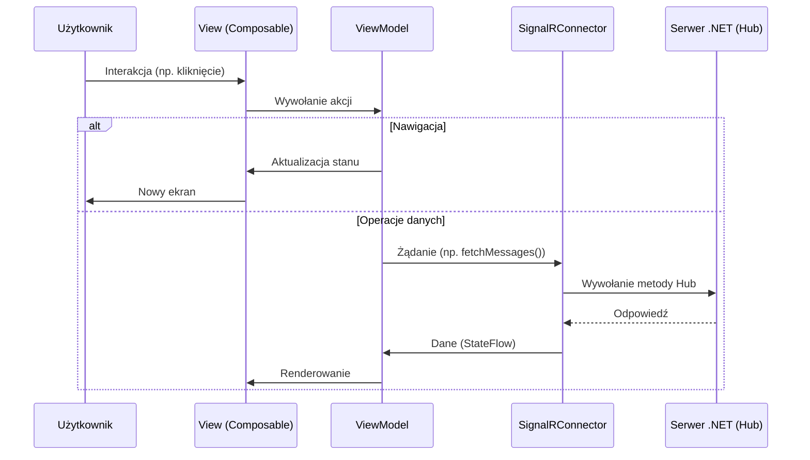

1. Wstęp

Cel aplikacji: "Umożliwia użytkownikom komunikację w czasie rzeczywistym za pomocą wiadomości tekstowych, zarówno w rozmowach indywidualnych, jak i grupowych".

Główne funkcje:

- Rejestracja i logowanie
- Tworzenie rozmów 1:1 i grupowych dla osób zarejestrowanych w aplikacji
- Wysyłanie i odbieranie wiadomości tekstowych, audio oraz zdjęć i wideo w czasie rzeczywistym
- Wybór nazw czatów
- Zmiana koloru tła

Użytkownicy docelowi: "Osoby prywatne i zespoły szukające prostego i szybkiego narzędzia do komunikacji mobilnej."

2. Architektura aplikacji mobilnej z wykorzystaniem SignalR i .NET

3. Technologie i narzędzia

- Język programowania: Kotlin
- Środowisko IDE: Android Studio
- Framework UI: Jetpack Compose
- Backend: serwer.NET, Room
- Komunikacja: SignalR (WebSocket)
- Baza danych: SQlite
- Kontrola wersji: Git + GitHub/GitLab

4. Warstwy aplikacji

a) Frontend (Klient)

- Technologie: Jetpack Compose (Android)
- Stan aplikacji: StateFlow (Android)
- Komunikacja z backendem: SignalR (czas rzeczywisty).

b) Backend

Serwer: 
- Autentykacja: Własna implementacja oparta o bearer tokeny i zapytania Restowe
- Baza danych: SQLite obsługiwane przez EntityFrameworkCore
- Komunikacja z frontendem: SignalR (czas rzeczywisty).

4. Wzorce architektoniczne

-  MVVM (Model-View-ViewModel) – separacja logiki od UI.
-  Backend (serwer) – .NET
-  Warstwa komunikacji –  SignalR

6. Kluczowe decyzje techniczne
   
Dlaczego SignalR? 
- Uproszczona obsługa WebSocketów – SignalR automatycznie wybiera najlepszy protokół komunikacji (WebSocket, Server-Sent Events, Long Polling), zapewniając stabilne połączenie nawet w słabych warunkach sieciowych.
- Fallback na Long Polling – Gdy WebSocket nie jest dostępny (np. przez restrykcyjne firewalle), SignalR przechodzi na Long Polling, zachowując ciągłość komunikacji.
- Wbudowane zarządzanie połączeniami – Automatyczne ponowne łączenie (reconnect), zarządzanie stanem klienta i grupowanie wiadomości (hub groups).
- Integracja z .NET – Backend aplikacji jest oparty na ASP.NET Core, a SignalR jest jego natywnym rozwiązaniem do komunikacji real-time.

Dlaczego StateFlow? "Reaktywność + integracja z Kotlin Coroutines".
- Reaktywność + Kotlin Coroutines – StateFlow jest w pełni kompatybilny z Coroutines, co pozwala na łatwe przetwarzanie strumieni danych w tle.
- Stan zachowywany między subskrypcjami – W przeciwieństwie do SharedFlow, StateFlow zawsze przechowuje ostatnią wartość, co jest kluczowe dla UI (np. lista kontaktów nie znika przy rotacji ekranu).
- Optymalizacja pod UI – StateFlow emituje wartości tylko wtedy, gdy są różne od poprzednich, minimalizując niepotrzebne przerysowania.
- Integracja z Jetpack Compose – collectAsState() pozwala na łatwe łączenie StateFlow z komponentami Compose.

Dlaczego Jetpack Compose?
- Deklaratywny UI – Łatwiejsze zarządzanie stanem i bardziej czytelny kod w porównaniu do tradycyjnego XML + ViewModel.
- Wydajność – Inteligentne recomposition tylko zmienianych elementów.
- Nowoczesne animacje – Wbudowane wsparcie dla płynnych przejść (np. animowane dodawanie kontaktów).

Clean Architecture + MVVM
Dlaczego ta struktura?
- Separacja warstw – Jasny podział na:
    i. Data (SignalR, Room, .NET)
    ii. Domain (logika biznesowa, use cases)
    iii. UI (Compose + ViewModel)
- Testowalność – Mockowanie zależności jest prostsze dzięki interfejsom.

7. Przepływ danych:
   
Użytkownik tworzy kanał → wysyłane jest żądanie REST API.

Serwer zapisuje kanał w SQLite i emituje zdarzenie SignalR "ChannelCreated".

Wszyscy klienci otrzymują aktualizację przez WebSocket.

Frontend aktualizuje UI (StateFlow/LiveData).

8. Wykorzystane biblioteki:

Ikony: https://fonts.google.com/icons

Interfejs Użytkownika i Kompozycja:

- androidx.compose.ui:ui-tooling-android
- androidx.compose.runtime:runtime-android•androidx.compose.ui:ui-android
- androidx.compose.foundation:foundation-android
- androidx.compose.material3:material3-android
- androidx.compose.material:material-icons-core-android 
- androidx.compose.animation:animation-android

Architektura i Cykl Życia:

- androidx.lifecycle:lifecycle-runtime-compose-android
- androidx.lifecycle:lifecycle-viewmodel-compose-android
- androidx.activity:activity-compose

Nawigacja:

- androidx.navigation:navigation-compose

Dodatkowo:

- androidx.room:room-runtime
- androidx.room:room-ktx 
- androidx.room:room-compiler
  
9. Testy

  Lista testów funkcjonalnych:
  
   -  Rejestracja i logowanie
    
       i. Użytkownik może założyć nowe konto.
       ii. Użytkownik może zalogować się poprawnym loginem i hasłem.
       iii. Użytkownik nie może zalogować się błędnymi danymi.

   - Lista kontaktów
    
       i. Wyświetla się lista dostępnych kontaktów wraz z ich awatarami.
       ii. Użytkownik może dodać kontakt.

   - Czat 1:1
    
       i. Użytkownik może rozpocząć nowy czat z wybranym kontaktem.
       ii. Wiadomości tekstowe są poprawnie wysyłane i odbierane.
       iii. Wiadomości są wyświetlane w kolejności chronologicznej.
       iv. Można dodać osobę do istniejacego czatu.
        v. Można zmienić nazwę czatu.

   - Czat grupowy
    
       i. Użytkownik może utworzyć nową grupę i nadać jej nazwę.
       ii. Użytkownik może dodać uczestników do grupy.
       iii. Członkowie grupy mogą wysyłać i odbierać wiadomości.
       iv. Wiadomości grupowe są widoczne dla wszystkich uczestników.

   - Załączniki i multimedia
    
       i. Można dodać zdjęcie lub inne multimedia do wiadomości.
       ii. Pliki są poprawnie ładowane i wyświetlane.
